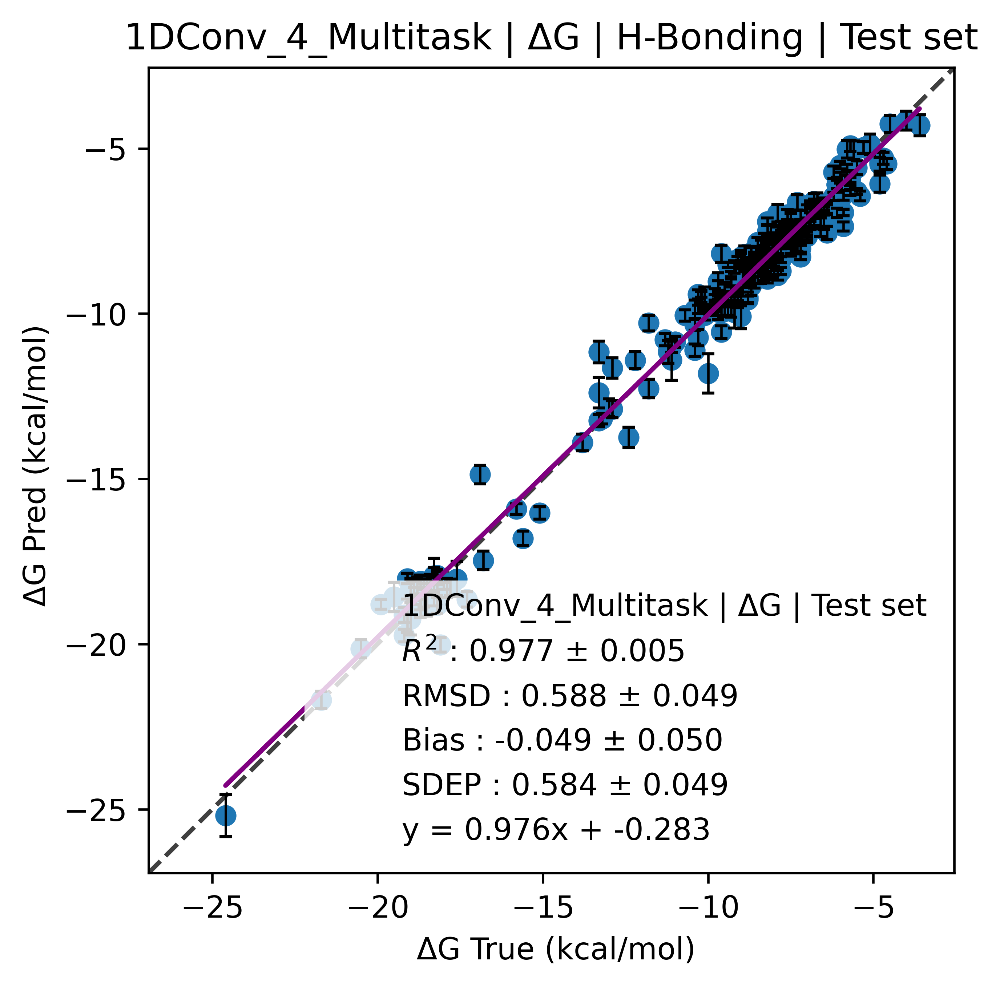
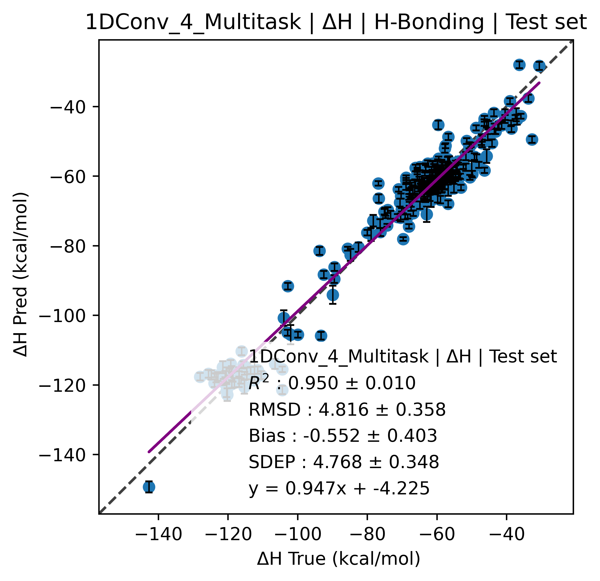
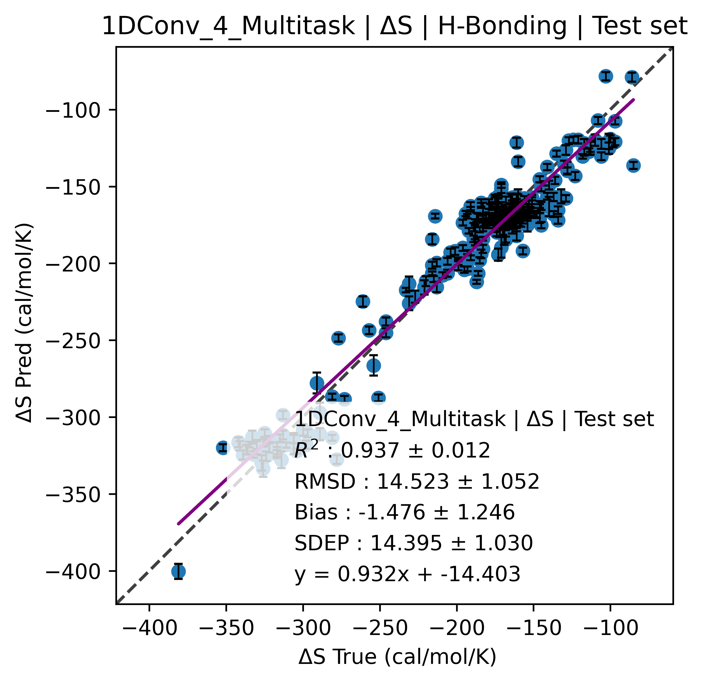

# Project: CNN single and multitask for DNA thermal Stability:
---
This project involves the implementation of Convolutional Neural Networks (CNNs) on High-Performance Computing (HPC) infrastructure, focusing on single-task and multitask learning for DNA duplexes, particularly for properties such as dG, dH, dS, and Tm. The CNN is designed for efficient batch job submissions and parallel processing, generating a significant amount of data, which is managed through compression. Here's a more specific breakdown of the contents:
---

## Folder Structure
### 1. `assets/`
- **Description**: Contains PNG images visualizing the model's performance on test sets. The images depict results from 50-fold cross-validation, reporting the mean and standard deviation of predictions.
- **Example Image:**








---

### 2. `bin/`
- **Description**: Contains helper functions and binaries used during development and execution. These files are temporary and will be discarded after the necessary tasks are completed.

---

### 3. `dev/`
- **Description**: This folder contains exploratory work for extending the CNN architecture. The development explores using four separate branches in the network, allowing each branch to specialize in a specific property (dG, dH, dS, Tm). This is designed to provide more accurate and specialized predictions compared to using a fully shared network.

---

### 4. `Evaluation_lomzov.ipynb`
- **Description**: A notebook that investigates the inner hyperparameter optimization loop. It performs a grid search to evaluate CNN architectures and hyperparameters, visualizing model performance and identifying the best configurations.

---

### 5. `Run_jobs.ipynb`
- **Description**: A notebook used for submitting single-task CNN jobs to the HPC. It handles the creation and submission of job scripts and moves completed jobs to storage efficiently.
- **Example Image:**

  

---

### 6. `Run_jobs-multitask.ipynb`
- **Description**: Similar to `Run_jobs.ipynb`, but tailored for multitask learning. This script submits batch jobs where the CNN shares the entire architecture except for four output nodes. Each output node handles a specific DNA duplex property, optimizing resource efficiency in an HPC environment.
- **Example Image:**

  

---

### 7. `environment.yaml`
- **Description**: Specifies the dependencies required for setting up the CNN environment using Anaconda. It ensures compatibility with TensorFlow and other libraries necessary for running the project.

---

### 8. `environment_builds.yaml`
- **Description**: Similar to `environment.yaml`, this file contains additional configurations and build-specific dependencies needed for different stages of the CNN project.

---

### 9. `tarfile.ipynb`
- **Description**: This notebook handles compressing the output files from the parallel jobs. Since the project generates over 2 million files, this script compresses and packages the results to save space and streamline storage.

---

## Project Goals

- **Multitask CNN**: The project aims to optimize a multitask architecture with shared layers and multiple output nodes, each handling a specific task.
- **Efficient Job Submission**: By leveraging HPC resources, the project submits and manages thousands of independent parallel jobs to maximize computational efficiency.
- **Hyperparameter Optimization**: The project uses grid search techniques to identify the best CNN architecture and hyperparameters for predicting DNA duplex properties.
- **Scalability**: Managing the large scale of output files through compression ensures the system can handle extensive datasets and parallel computations without overwhelming storage.

---

## How to Run the Project

1. Clone the repository to your local machine or HPC environment.
2. Set up the environment using Anaconda:
   ```bash
   conda env create -f environment.yaml
